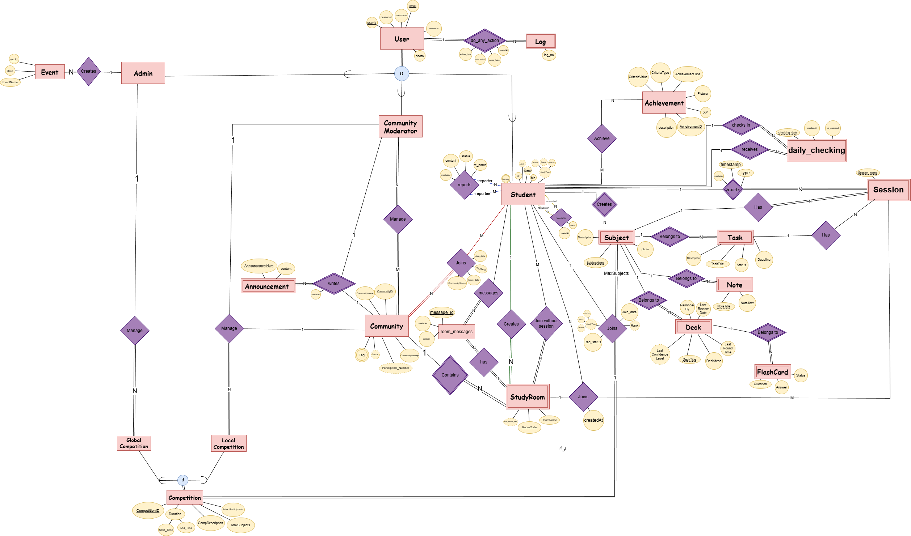

<div align="center">
  
  <h1>YASTA <span style="color: #a855f7">FOCUS</span></h1>
  <p><strong>A Gamified Educational & Productivity Hub</strong></p>
</div>

<p align="center">
    <a href="https://yasta-focus.netlify.app/">
        
    </a>
</p>

<div align="center">
  
  
  
  
  
  
</div>

---

## 🚀 Overview

**Yasta Focus** is a comprehensive platform designed to enhance student productivity and engagement through gamification and community features. It combines essential study tools with social interaction to create a motivating environment for learning.

## ✨ Features

### 🧠 Productivity Tools
- **Focus Timer**: Customizable Pomodoro-style timer to manage study sessions.
- **Subjects & Tasks**: Organize study materials and track assignments.
- **Notes**: Rich text editor for taking and organizing study notes.
- **AI-Powered Chat**: AI chat for student subjects.

### 👥 Community & Social
- **Study Rooms**: Join virtual rooms with video and chat capabilities to study with peers.
- **Communities**: Create or join interest-based groups.
- **Friends System**: Connect with other students and give xp gifts for them.
- **Leaderboards**: Compete globally or within communities (Daily, Weekly, All-time).

### 🏆 Gamification
- **Competitions**: Participate in global or local community challenges.
- **Achievements**: Earn badges and rewards for study streaks and milestones.
- **Levels & XP**: Gain experience points for every productive action.

### 📅 Events
- **Live Events**: Host or attend live video sessions and workshops.

### 🛡️ Admin Dashboard
- **Analytics**: Comprehensive reports on user engagement and content creation.
- **User Management**: Manage users, communities, and content.
- **System Control**: Create global competitions and manage platform settings.

## 🛠️ Tech Stack

### Frontend
- **Core**: [React 19](https://react.dev/), [Vite 7](https://vitejs.dev/)
- **Styling**: [TailwindCSS 4](https://tailwindcss.com/)
- **Navigation**: [React Router 7](https://reactrouter.com/)
- **State Management**: [TanStack React Query 5](https://tanstack.com/query/latest)
- **Forms & Validation**: [React Hook Form](https://react-hook-form.com/)
- **UI Components & Icons**: [Lucide React](https://lucide.dev/), [Radix UI](https://www.radix-ui.com/)
- **Real-time**: [Socket.io Client](https://socket.io/), [Stream Video SDK](https://getstream.io/video/), [Stream Chat SDK](https://getstream.io/chat/)
- **Visualization**: [Recharts](https://recharts.org/)
- **Utilities**: [Axios](https://axios-http.com/), [React Hot Toast](https://react-hot-toast.com/), [React MD Editor](https://uiwjs.github.io/react-md-editor/), [Uploadcare](https://uploadcare.com/), [React Snowfall](https://github.com/cahilfoley/react-snowfall)
- **Development**: ESLint, Vite Plugins

### Backend
- **Runtime**: [Node.js](https://nodejs.org/)
- **Framework**: [Express 5](https://expressjs.com/)
- **Database**: [PostgreSQL](https://www.postgresql.org/) (via `pg`)
- **Authentication**: [JSON Web Token (JWT)](https://jwt.io/), [Bcryptjs](https://github.com/dcodeIO/bcrypt.js)
- **AI Integration**: [Google Gemini AI](https://ai.google.dev/aistudio)
- **Real-time**: [Socket.io](https://socket.io/), [Stream Node SDK](https://getstream.io/video/)
- **Utilities**: [Axios](https://axios-http.com/), [Dotenv](https://github.com/motdotla/dotenv), [Cookie Parser](https://github.com/expressjs/cookie-parser), [CORS](https://github.com/expressjs/cors)
- **Development**: [Nodemon](https://nodemon.io/)

## 🗄️ Enhanced Entity Relationship Diagram (EER)



## 📸 Screenshots

<div align="center">
  
  <p><em>Admin Dashboard with Analytics</em></p>
</div>

| | |
|:-------------------------:|:-------------------------:|
|  <br> **Community & Study Rooms** |  <br> **Profile Page** |
|  <br> **Leaderboards** |  <br> **Focus Timer** |
|  <br> **AI Chat Assistant** |  <br> **Communities** |

## 💻 Run Locally

Prerequisites: **Node.js** and **PostgreSQL** installed.

### 1. Clone the project

```bash
git clone https://github.com/your-username/yasta-focus.git
cd yasta-focus
```

### 2. Backend Setup

Navigate to the backend directory:
```bash
cd yasta-focus-backend
npm install
```

Create a `config.env` file in the root of `yasta-focus-backend`:
```env
PG_USER=XXX
PG_PASSWORD=XXX
PG_HOST=XXX
PG_PORT=XXX
PG_DATABASE=postgres

NODE_ENV=development
PORT=3000

JWT_SECRET=XXX
JWT_EXPIRES_IN=XXX
JWT_COOKIE_EXPIRES_IN=XXX

GROQ_API_KEY=XXX

STREAM_API_KEY=XXX
STREAM_SECRET=XXX
```

Start the server:
```bash
npm run start
```

### 3. Frontend Setup

Navigate to the frontend directory:
```bash
cd ../yasta-focus-frontend
npm install
```

Create a `.env` file in the root of `yasta-focus-frontend`:
```env
VITE_STREAM_API_KEY=XXX
VITE_API_URL=http://localhost:3000/api
VITE_UPLOADCARE_PUBLIC_KEY=XXX
```

Start the application:
```bash
npm run dev
```

Visit `http://localhost:5173` to view the app.

---

<div align="center">
  <p>Made with ❤️ by the Yasta Focus Team</p>
</div>
<table align = "center">
<tr>
  <td align = "center"> 
	<a href = "https://github.com/georgeibrahim1">
	  
	  <br />
	  <sub> George Ibrahim </sub>
	</a>
  </td>
  <td align = "center"> 
	<a href = "https://github.com/OMAR-Zizo827">
	  
	  <br />
	  <sub> Omar Abdelaziz </sub>
	</a>
  </td>
  <td align = "center"> 
	<a href = "https://github.com/PierreEhab-1337">
	  
	  <br />
	  <sub> Pierre Ehab </sub>
	</a>
  </td>
  <td align = "center"> 
	<a href = "https://github.com/NourEl-deenAhmed">
	  
	  <br />
	  <sub> Nour El-deen Ahmed </sub>
	</a>
  </td>
</tr>
</table>
